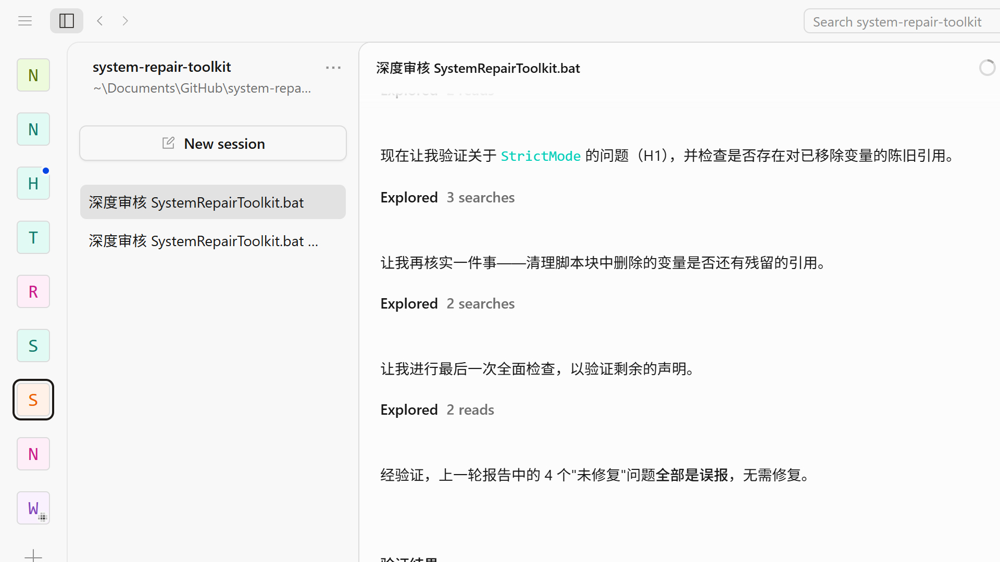

# WIM Driver Studio

A comprehensive PowerShell/WPF application for injecting drivers into Windows Image (WIM) files with intelligent boot.wim vs install.wim driver suitability judgment, enterprise-grade security, and Windows 11 Fluent Design UI.



## Features

### Driver Target Suitability Judgment
- **Auto-detects WIM type**: Distinguishes `boot.wim` (Windows PE/Setup) from `install.wim` (full Windows installation) via filename heuristic and DISM index name inspection.
- **Architecture matching**: Reads INF `NTamd64`/`NTarm64`/`NTx86` decorations and rejects architecture-mismatched drivers.
- **Class-based filtering for boot.wim**: Only recommends storage (SCSIAdapter, HDC, DiskDrive, Volume, USB, SDHost) and network (net, NetClient, NetService, NetTrans) driver classes per [Microsoft's WinPE driver guidance](https://learn.microsoft.com/en-us/windows-hardware/manufacture/desktop/winpe-mount-and-customize). Excludes audio, camera, display, biometric, and other PE-irrelevant classes.
- **Storage controller detection within System class**: Uses PCI mass-storage class codes (`CC_01xx`) and storage service binary names (`.sys` with word-boundary matching) to identify storage controllers hidden in the ambiguous `System` class, so Setup can see the disk.
- **Smart partition UI**: Splits the driver list into "Recommended" (pre-checked) and "Not recommended" (unchecked, with reason) groups. User can override by checking not-recommended drivers.

### Driver Management
- **Inject drivers**: Add driver packages (.inf) into all WIM indexes via DISM `/Add-Driver`.
- **Inventory drivers**: List all drivers installed in a mounted WIM image.
- **Remove drivers**: Safely remove third-party drivers with boot-critical class protection.
- **Export drivers**: Backup drivers from a mounted image to a folder.
- **Batch-style or individual processing**: Choose between fast recursive folder injection or per-driver individual injection.

### Security
- Path traversal attack prevention
- Dangerous character validation
- Protected system directory enforcement
- Symbolic link target validation
- Sensitive output redaction (passwords, tokens, keys)
- SHA-256 file integrity hashing
- Authenticode signature verification (INF, .cat, .sys, .dll)

### UI/UX
- Windows 11 Fluent Design (rounded corners, shadows, Segoe UI Variable, Segoe MDL2 Assets icons)
- Thread-safe state management with Monitor locks
- DPI awareness for high-DPI displays
- Progress monitoring with rate-limited UI updates
- Comprehensive accessibility (AutomationProperties, keyboard navigation)
- Micro-interaction animations on buttons
- Full PowerShell 5.1 compatibility

## Requirements

- **OS**: Windows 10/11 (x64 or ARM64)
- **PowerShell**: 5.1+ (Windows PowerShell)
- **Privileges**: Administrator
- **DISM**: Available in System32 (included with Windows)
- **.NET**: .NET Framework 4.7.2+ (WPF)

## Quick Start

```powershell
# Run as Administrator
Start-Process PowerShell -ArgumentList "-File .\WIM_Driver_Studio.ps1" -Verb RunAs
```

## Workflow

1. **Select WIM file** — Browse for `boot.wim` or `install.wim`. The tool auto-detects the image type and architecture.
2. **Select driver folder** — Browse for a folder containing `.inf` driver packages.
3. **Scan drivers** — Scans the folder recursively. Drivers are partitioned into:
   - **Recommended** for the selected image type (pre-checked)
   - **Not recommended** (unchecked, with reason — override if needed)
4. **Configure** — Set mount directory, recursive search, force unsigned options.
5. **Start** — Mounts each WIM index, injects selected drivers, commits and unmounts.

## boot.wim vs install.wim Driver Suitability

Per [Microsoft documentation](https://learn.microsoft.com/en-us/windows-hardware/manufacture/desktop/winpe-mount-and-customize), Windows PE only needs drivers for:

> "drivers that support **network cards or storage devices**"

The tool applies these rules:

| Image Type | Suitable Classes | Excluded Classes |
|------------|-----------------|------------------|
| **boot.wim** | net, SCSIAdapter, HDC, DiskDrive, Volume, SCSI, USB, SDHost, USBFunctionController + System-class storage controllers | MEDIA, Camera, Display, Biometric, Mouse, HIDClass, Bluetooth, SoftwareComponent, Extension, Ports |
| **install.wim** | All architecture-matched drivers | Architecture-mismatched only |

## Project Structure

```
WIM_Driver_Studio/
├── WIM_Driver_Studio.ps1   # Main application (single file)
├── README.md
├── LICENSE
└── .gitignore
```

## Author

**Yan Zhou**

## License

MIT — see [LICENSE](LICENSE).
